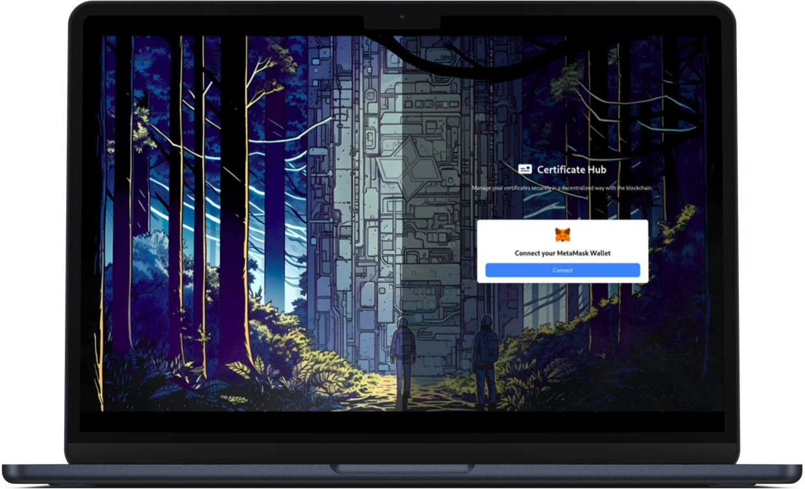

<p align="center"></p>

<br>

<p align="center">
   <br/>
  <a href="https://github.com/mateus-sartorio/descentralized-pik-with-blockchain-backend"><kbd>🔵 GitHub</kbd></a>
</p>

# 🪪 Certification Hub (Back End)

### Decentralized certificates.

The backend of this application is responsible for managing interactions with the blockchain and the Cartesi Machine, implementing a Decentralized Public Key Infrastructure (DPKI). It was developed using the  TypeScript programming language and is designed to work in conjunction with a blockchain based on the Ethereum Virtual Machine (EVM).

<br/>

## 🖥️ Front End client

A Front End client to interact with this application can be found [here](https://github.com/mateus-sartorio/descentralized-pik-with-blockchain-frontend).

<br>


## 🔥 Features

- #### Create new certificates in a descentralized way.
- #### View created certificates.

<br>


## 🍄 Philosophy

This project is intended to be simple and easy to use. The functionalities are kept minimal but refined.

<br/>


## ⚙️ Set up and run locally

### Requirements:

- Docker
- Cartesi

For Docker, installation instructions for each operating system can be found in its [official documentation](https://docs.docker.com/engine/install).

For Cartesi, you can find installation instructions in its [official documentation](https://docs.cartesi.io/cartesi-rollups/1.3/development/installation).

Before starting, make sure you have all the requirements to run the project, and make sure Docker Engine is running on your machine.


### Running the Application

Clone the repository locally. Then, navigate to the directory of the cloned repository:

```bash
git clone https://github.com/mateus-sartorio/descentralized-pik-with-blockchain-backend backend
cd backend
```

In the project directory, to build the application, execute:

```bash
cartesi build
```

To run the application, execute:

```bash
cartesi run
```

> [!TIP]  
> It is strongly recommended to use this application alongside its Front End client, which can be found [here](https://github.com/mateus-sartorio/descentralized-pik-with-blockchain-frontend).
>
> To utilize the Front End client, you will need to install the [Metamask](https://metamask.io) browser extension and add one of the wallets generated by this application to your Metamask account. To do this, you’ll need the private keys associated with the wallets. To obtain these private keys, run the application with the `--verbose` flag:
>
> ```bash
> cartesi run --verbose
> ```
>
> This will display the wallets' private keys in your terminal when the application launches.

> [!TIP]  
> Every time you restart the Back End, you should clear Metamask's transfer history, or transactions might not succeed.

<br/>


## ⚠️ Limitations

- The project stores data in an array, a database configuration could be added for better scalability.
- There isn't a search functionality for certificates, all valid certificates are always returned on inspect calls.

<br>


## ⚖️ License:

Copyright Universidade Federal do Espirito Santo (UFES)

This program is free software: you can redistribute it and/or modify it under the terms of the GNU General Public License as published by the Free Software Foundation, either version 3 of the License, or (at your option) any later version.

This program is distributed in the hope that it will be useful, but WITHOUT ANY WARRANTY; without even the implied warranty of MERCHANTABILITY or FITNESS FOR A PARTICULAR PURPOSE.  See the GNU General Public License for more details.

You should have received a copy of the GNU General Public License along with this program.  If not, see <https://www.gnu.org/licenses/>.

This program is released under license GNU GPL v3+ license.


## 🛟 Support:

Please report any issues with the application at [github.com/mateus-sartorio/descentralized-pik-with-blockchain-backend](https://github.com/mateus-sartorio/descentralized-pik-with-blockchain-backend).
